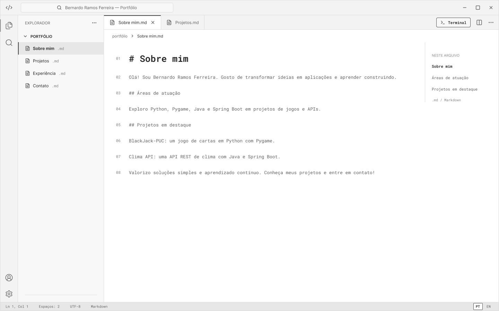
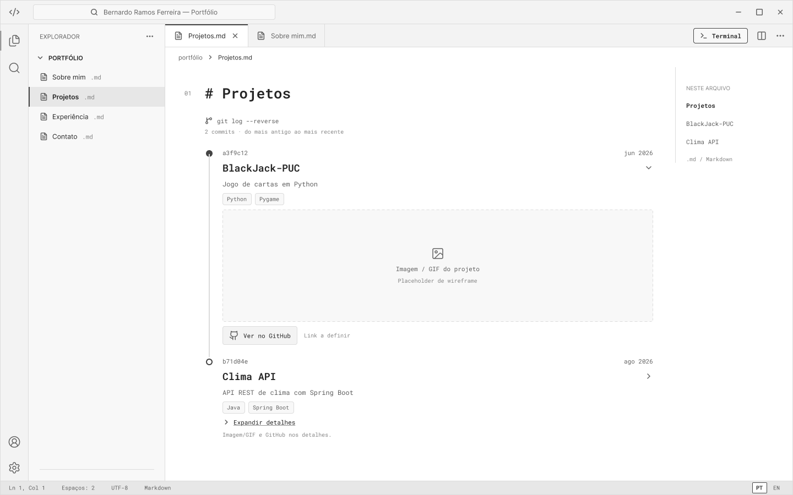
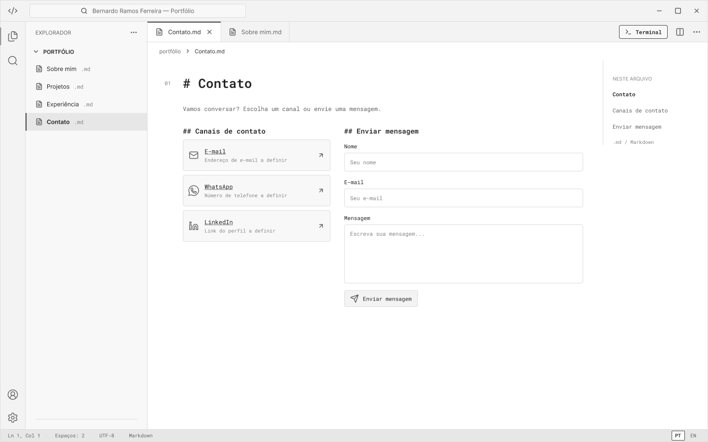
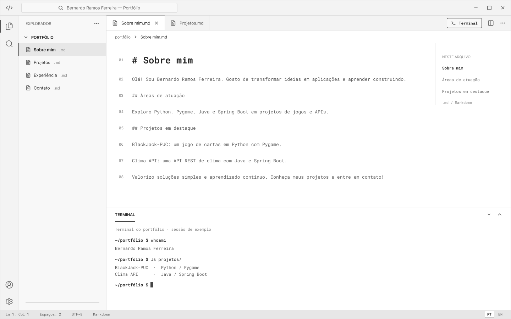
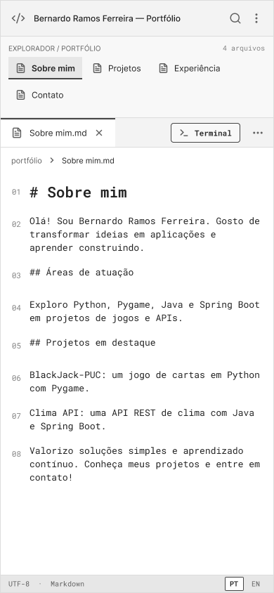
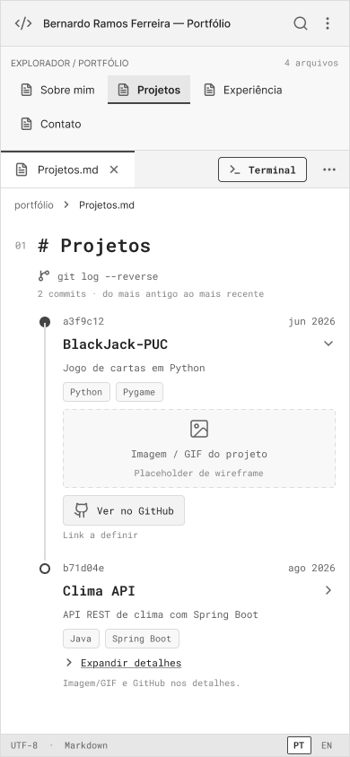
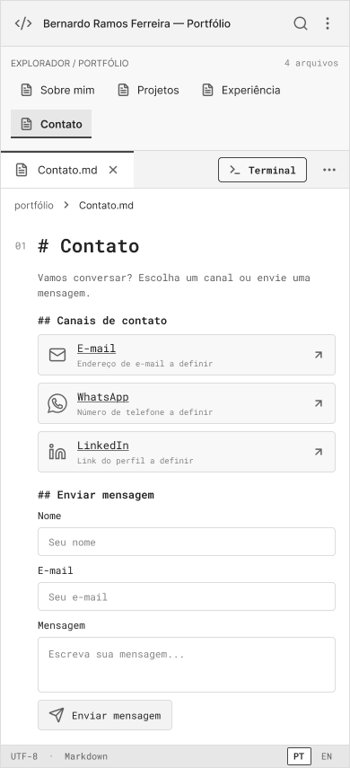
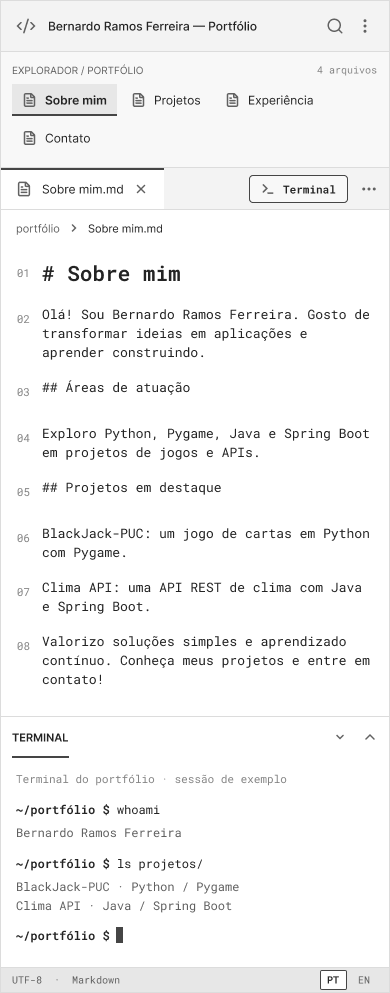

# 💻 Portfólio

> [!NOTE]
> Portfólio profissional em formato de **editor de código**: cada seção do site é um arquivo, os projetos aparecem como commits de um `git log` e um terminal integrado permite explorar o conteúdo.

<p align="center"></p>

---

## 🚧 Status do Projeto


| Sprint | Entrega | Status |
| :--- | :--- | :---: |
| Lab01S01 | Planejamento, protótipos no Figma, navegação e layout base | 🚧 Em andamento |
| Lab01S02 | Funcionalidades principais (Sobre mim PT/EN, timeline, experiências, contato) | ⏳ Planejado |
| Lab01S03 | Deploy, ajustes visuais, GIFs dos projetos e README final | ⏳ Planejado |

---

## 📚 Índice
- [Links Úteis](#-links-úteis)
- [Sobre o Projeto](#-sobre-o-projeto)
- [Funcionalidades Principais](#-funcionalidades-principais)
- [Tecnologias Utilizadas](#-tecnologias-utilizadas)
- [Arquitetura](#-arquitetura)
- [Instalação e Execução](#-instalação-e-execução)
- [Deploy](#-deploy)
- [Estrutura de Pastas](#-estrutura-de-pastas)
- [Demonstração](#-demonstração)
- [Documentações utilizadas](#-documentações-utilizadas)
- [Autores](#-autores)

---

## 🔗 Links Úteis
* 🌐 **Site publicado:** [Acesse o portfólio](<link-do-site-publicado>)
  > Link de produção (a definir após o deploy na Sprint 3).
* 🎨 **Protótipos no Figma:** [Ver wireframes](<https://www.figma.com/design/M14F6SjfmMztR2751UTDP9/Wireframe-Portf%C3%B3lio?node-id=0-1&t=8WGaRr0sx56Vhz5W-1>)
  > Wireframes de média fidelidade (desktop e mobile).
* 📦 **Repositório:** [GitHub](<https://github.com/bernardorf5/Portfolio-Profissional>)

---

## 📝 Sobre o Projeto

Este projeto é o meu **portfólio profissional**, desenvolvido no Laboratório 01 da disciplina de Desenvolvimento e Integração de Aplicações Web (DIAW), do curso de Engenharia de Software da PUC Minas.

O objetivo é apresentar minha trajetória, habilidades, projetos e formas de contato de maneira moderna e acessível. Em vez de uma página tradicional, o site simula um **editor de código**: o visitante navega por arquivos (`Sobre mim`, `Projetos`, `Experiência` e `Contato`), abre abas, acompanha a timeline de projetos como se fosse um histórico de commits e pode usar um terminal para explorar o conteúdo.

---

## ✨ Funcionalidades Principais

- [ ] 📁 **Navegação estilo editor:** explorador de arquivos lateral, abas e breadcrumb.
- [ ] 🌐 **Sobre mim em português e inglês:** alternância de idioma (PT/EN) pela barra de status.
- [ ] 🕒 **Timeline de projetos estilo `git log`:** do mais antigo ao mais recente, com nome, descrição, tecnologias, link do GitHub e imagem/GIF em cada projeto.
- [ ] 💼 **Experiências:** empresa/instituição, cargo ou atividade, período e breve descrição.
- [ ] ✉️ **Contato:** ícones clicáveis (e-mail, WhatsApp, LinkedIn) e formulário com nome, e-mail e mensagem, com envio por e-mail e validações básicas.
- [ ] 🖥️ **Terminal integrado:** painel que abre e fecha por botão (comandos a definir).
- [ ] 📱 **Design responsivo:** layout adaptado para desktop e celular.

---

## 🛠 Tecnologias Utilizadas

Tecnologias **previstas** para esta etapa. As versões exatas ficam registradas no `package.json`.

### 💻 Front-end

* **Biblioteca:** React
* **Linguagem:** JavaScript (ES6+)
* **Build Tool:** Vite
* **Estilização:** CSS puro

### ☁️ Serviços e ferramentas

* **Envio de e-mail (formulário de contato):** EmailJS
* **Hospedagem:** Vercel
* **Protótipos e wireframes:** Figma
* **Versionamento:** Git e GitHub

### 📦 Dependências principais

| Pacote | Para quê |
| :--- | :--- |
| `react` e `react-dom` | Construção da interface com componentes |
| `vite` | Servidor de desenvolvimento e build |
| `@emailjs/browser` | Envio do formulário de contato por e-mail |

> [!NOTE]
> Esta tabela será atualizada conforme novas bibliotecas forem adicionadas ao projeto.

---

## 🏗 Arquitetura

Aplicação **front-end (SPA)** sem back-end próprio. A interface é dividida em componentes que imitam as partes de um editor de código.

**Principais componentes (previstos):**

- **Titlebar:** barra superior com o título do site.
- **Explorer:** lista de arquivos (as seções do portfólio).
- **Tabs:** abas dos arquivos abertos.
- **Editor:** área central que exibe o conteúdo do arquivo selecionado.
- **StatusBar:** barra inferior com o seletor de idioma (PT/EN).
- **Terminal:** painel inferior que abre e fecha.

**Decisões de projeto:**

- Os dados (projetos, experiências e textos em PT/EN) ficam em arquivos separados do código dos componentes. Assim, a timeline e o terminal leem a mesma lista de projetos e um projeto novo aparece nos dois lugares.
- O estado da interface (arquivo aberto, idioma, terminal aberto ou fechado) é controlado pelo React.

---

## 🔧 Instalação e Execução

### Pré-requisitos

* **Node.js:** versão LTS (v18.x ou superior)
* **Gerenciador de pacotes:** npm

### Variáveis de Ambiente

Crie um arquivo `.env.local` na raiz do projeto (ele **não** deve ser versionado). Use o `.env.example` como referência. No Vite, as variáveis precisam começar com `VITE_`.

| Variável | Descrição |
| :--- | :--- |
| `VITE_EMAILJS_SERVICE_ID` | ID do serviço configurado no EmailJS |
| `VITE_EMAILJS_TEMPLATE_ID` | ID do template de e-mail |
| `VITE_EMAILJS_PUBLIC_KEY` | Chave pública do EmailJS |

### Instalação de Dependências

```bash
git clone <https://github.com/bernardorf5/Portfolio-Profissional.git>
cd <Portfolio-Profissional>
npm install
```

### Como Executar

```bash
npm run dev
```

🎨 *O site estará disponível em **http://localhost:5173** (ou na porta indicada pelo Vite).*

### Build de produção

```bash
npm run build     # gera a pasta /dist
npm run preview   # simula a produção localmente
```

---

## 🚀 Deploy

O site é publicado gratuitamente na **Vercel**.

1. Envie o projeto para o GitHub.
2. Na Vercel, importe o repositório (**Add New > Project**).
3. Confirme o preset **Vite** (comando de build `npm run build`, pasta de saída `dist`).
4. Cadastre as variáveis `VITE_EMAILJS_*` em **Settings > Environment Variables**.
5. Clique em **Deploy** e copie o link gerado para a seção [Links Úteis](#-links-úteis).

---

## 📂 Estrutura de Pastas

Estrutura **prevista** (pode mudar durante o desenvolvimento).

```
.
├── README.md                # 📘 Documentação principal
├── .gitignore               # 🧹 Arquivos ignorados pelo Git (node_modules, .env.local, dist)
├── .env.example             # 🧩 Exemplo das variáveis de ambiente (sem valores reais)
├── index.html               # 📄 Página base
├── package.json             # 📦 Dependências e scripts
├── vite.config.js           # ⚙️ Configuração do Vite
│
├── /public                  # 📂 Arquivos estáticos
├── /docs
│   └── /prototipos          # 🎨 Imagens dos wireframes usadas neste README
│
└── /src
    ├── main.jsx             # 🚪 Ponto de entrada da aplicação
    ├── App.jsx              # 🧱 Layout principal
    ├── /components          # 🧱 Titlebar, Explorer, Tabs, Editor, StatusBar, Terminal
    ├── /pages               # 📄 Conteúdo de cada arquivo: Sobre mim, Projetos, Experiência, Contato
    ├── /data                # 🗂️ Projetos e experiências
    ├── /i18n                # 🌐 Textos em português e inglês
    ├── /styles              # 🎨 Estilos globais
    └── /assets              # 🖼️ Imagens e GIFs dos projetos
```

---

## 🎥 Demonstração

### 🎨 Protótipos (Sprint 1)

Wireframes de média fidelidade feitos no Figma.

#### 💻 Desktop

| Sobre mim | Projetos |
| :---: | :---: |
|  |  |
| **Contato** | **Terminal aberto** |
|  |  |

#### 📱 Mobile

| Sobre mim | Projetos | Contato | Terminal aberto |
| :---: | :---: | :---: | :---: |
|  |  |  |  |

### 🌐 Site em funcionamento (Sprint 3)

_Prints e GIFs do site publicado serão adicionados aqui._

---

## 🔗 Documentações utilizadas

* 📖 **React:** [react.dev](https://react.dev/)
* 📖 **Vite:** [vitejs.dev](https://vitejs.dev/)
* 📖 **EmailJS:** [Documentação oficial](https://www.emailjs.com/docs/)
* 📖 **Vercel:** [Documentação oficial](https://vercel.com/docs)
* 📖 **Figma:** [figma.com](https://www.figma.com/)

---

## 👥 Autores

| 👤 Nome | :octocat: GitHub | 💼 LinkedIn | 📤 E-mail |
|---------|------------------|-------------|-----------|
| Bernardo Ramos Ferreira | [GitHub](<https://github.com/bernardorf5>) | [LinkedIn](<https://www.linkedin.com/in/bernardoramosferreira>) | [E-mail](mailto:bernardoramosf22@gmail.com) |

---